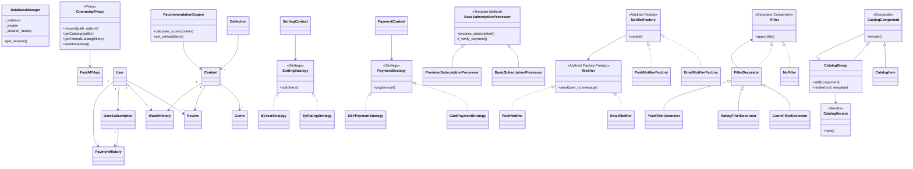

# Финальная диаграмма классов

```mermaid
classDiagram
    class FastAPIApp
    class DatabaseManager {
        -_instance
        -_engine
        -_session_factory
        +get_session()
    }

    class User
    class Content
    class Genre
    class Review
    class WatchHistory
    class Collection
    class UserSubscription
    class PaymentHistory

    User "1" --> "*" Review
    User "1" --> "*" WatchHistory
    User "1" --> "*" UserSubscription
    User "1" --> "*" PaymentHistory
    Content "*" --> "*" Genre
    Content "1" --> "*" Review
    Content "1" --> "*" WatchHistory
    Collection "*" --> "*" Content
    UserSubscription "1" --> "*" PaymentHistory

    class SortingStrategy {
        <<Strategy>>
        +sort(items)
    }
    class ByRatingStrategy
    class ByYearStrategy
    class SortingContext
    SortingStrategy <|.. ByRatingStrategy
    SortingStrategy <|.. ByYearStrategy
    SortingContext --> SortingStrategy

    class PaymentStrategy {
        <<Strategy>>
        +pay(amount)
    }
    class CardPaymentStrategy
    class SBPPaymentStrategy
    class PaymentContext
    PaymentStrategy <|.. CardPaymentStrategy
    PaymentStrategy <|.. SBPPaymentStrategy
    PaymentContext --> PaymentStrategy

    class BaseSubscriptionProcessor {
        <<Template Method>>
        +process_subscription()
        #_verify_payment()
    }
    class BasicSubscriptionProcessor
    class PremiumSubscriptionProcessor
    BaseSubscriptionProcessor <|-- BasicSubscriptionProcessor
    BaseSubscriptionProcessor <|-- PremiumSubscriptionProcessor

    class INotifier {
        <<Abstract Factory Product>>
        +send(user_id, message)
    }
    class EmailNotifier
    class PushNotifier
    class NotifierFactory {
        <<Abstract Factory>>
        +create()
    }
    class EmailNotifierFactory
    class PushNotifierFactory
    INotifier <|.. EmailNotifier
    INotifier <|.. PushNotifier
    NotifierFactory <|.. EmailNotifierFactory
    NotifierFactory <|.. PushNotifierFactory
    NotifierFactory --> INotifier

    class IFilter {
        <<Decorator Component>>
        +apply(data)
    }
    class NoFilter
    class FilterDecorator
    class GenreFilterDecorator
    class RatingFilterDecorator
    class YearFilterDecorator
    IFilter <|.. NoFilter
    IFilter <|.. FilterDecorator
    FilterDecorator <|-- GenreFilterDecorator
    FilterDecorator <|-- RatingFilterDecorator
    FilterDecorator <|-- YearFilterDecorator
    FilterDecorator --> IFilter

    class RecommendationEngine {
        +calculate_score(content)
        +get_ranked(items)
    }
    RecommendationEngine --> Content

    class CinemaApiProxy {
        <<Proxy>>
        +request(path, options)
        +getCatalog(sortBy)
        +getFilteredCatalog(filters)
        +seedDatabase()
    }
    class CatalogComponent {
        <<Composite>>
        +render()
    }
    class CatalogItem
    class CatalogGroup {
        +add(component)
        +render(root, template)
    }
    class CatalogIterator {
        <<Iterator>>
        +next()
    }
    CatalogComponent <|-- CatalogItem
    CatalogComponent <|-- CatalogGroup
    CatalogGroup o-- CatalogComponent
    CatalogGroup --> CatalogIterator
    CinemaApiProxy --> FastAPIApp
```
